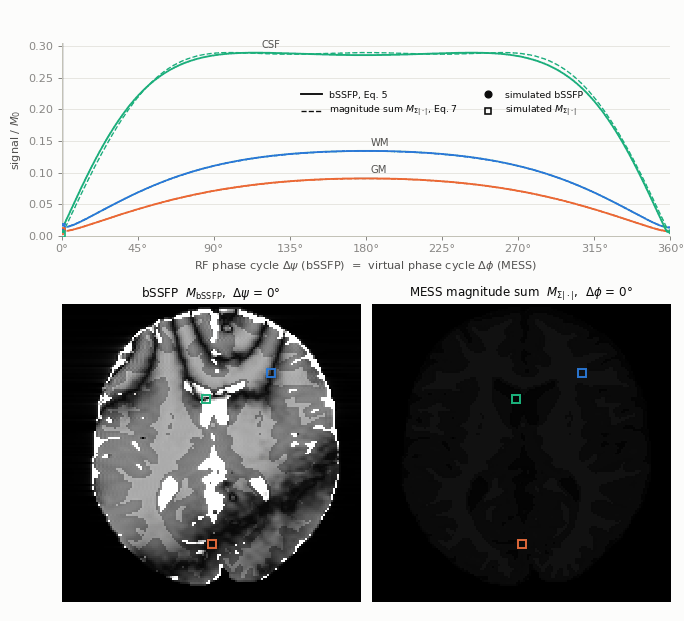
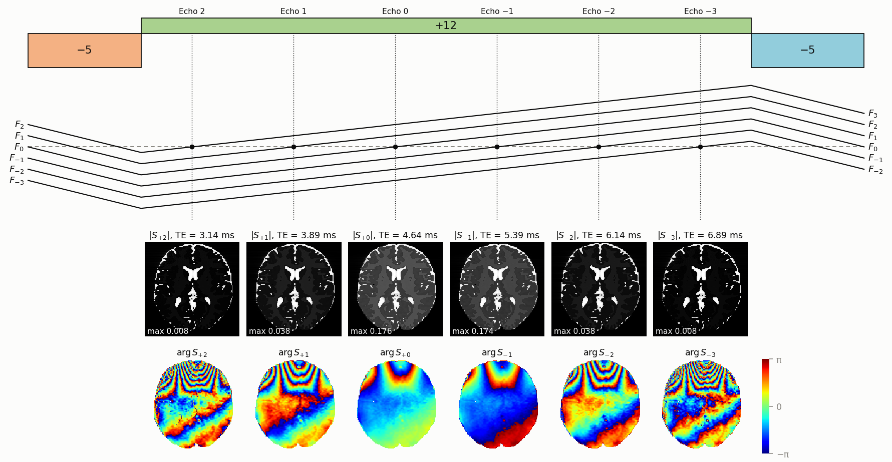
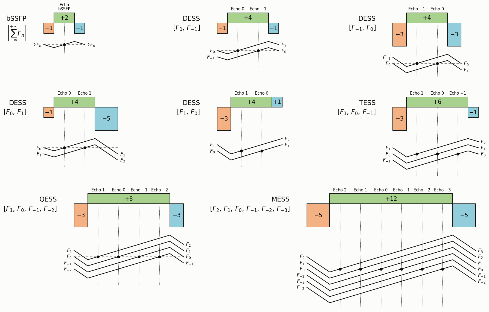

# MESS — multi-echo SSFP in Pulseq

Reference implementation of **multi-echo steady-state free precession (MESS)**:

> H. Hong, M. N. Hoff, W. Yang, Y. Dong, Z. Zhou, P. Hu. **Multi-Echo SSFP: A Method for
> Synthetic bSSFP MRI Contrast Without Banding Artifacts at High Field.**
> *Magn Reson Med* 2026;96(4):1696–1708. [doi:10.1002/mrm.70472](https://doi.org/10.1002/mrm.70472)



A bSSFP image is the coherent sum of all SSFP coherence pathways — the *dephasing orders* $k$ —
at one echo time, and their interference produces dark bands wherever the off-resonance is
unfavourable. MESS refocuses the orders one after the other inside every TR and samples their
echoes $S_k$ separately:



Top: prephaser, readout and rewinder of one TR with their moments in units of
$u=N_\text{RO}/(2\,\text{FOV}_\text{RO})$, and the extended phase graph of the acquired pathways
$F_2,\dots,F_{-3}$; each forms its echo where it crosses zero inside the readout. Below: the
image of every echo, magnitude $|S_k|$ (each on its own grey scale) and phase $\arg S_k$, placed
under the echo it comes from (MR-zero simulation of a brain phantom, notebook 3). None of the echoes
shows banding.

From one acquisition you can then

* sum the echoes coherently with a **virtual phase-cycle** increment $\Delta\phi$,
  $M_\Sigma(\Delta\phi)=\sum_k S_k e^{ik\Delta\phi}$, which reproduces RF phase-cycled bSSFP,
  bands included (Eq. 6 of the paper), or
* sum their magnitudes, $M_{\Sigma|\cdot|}(\Delta\phi)=\sum_k |S_k|\,e^{i\{k\Delta\phi+[u(k)-1]\pi\}}$,
  which gives bSSFP-like contrast **without banding**, tunable after the scan with $\Delta\phi$
  (Eq. 7).

## Installation

```bash
pip install -e .              # the mess package: numpy + pypulseq
pip install -e ".[notebooks]" # + matplotlib, scipy, MRzeroCore, torch, jupyter
```

The sequences of the paper were built with
[PyPulseq-Matlab-like](https://github.com/m-a-x-i-m-z/pypulseq-matlab-like) (Pulseq v1.5.1), whose
`make_slr_pulse` provides the SLR excitation:

```bash
pip install git+https://github.com/m-a-x-i-m-z/pypulseq-matlab-like@master
```

With a PyPulseq that lacks `make_slr_pulse`, the protocols fall back to a sinc pulse and say so.

## Quick start

```python
import numpy as np
import mess

protocol = mess.MESS3D(orders=(2, -3), flip_angle=50)   # the 3D protocol of the paper
print(protocol)             # moments G1..G3, TR, TE_0, delta TE and every TE_k
protocol.make_sequence(phase_cycle=0.0).write("mess.seq")
protocol.bssfp().make_sequence(phase_cycle=np.pi).write("bssfp.seq")   # matched reference
```

After splitting every readout into its echoes and Fourier-transforming each of them
(`mess.split_echoes`), the images `S` (orders along the first axis) are combined with

```python
M_sigma = mess.complex_sum(S, protocol.orders, dphi=np.pi)     # Eq. 6
M_mag = mess.magnitude_sum(S, protocol.orders, dphi=np.pi)     # Eq. 7
```

## Sequences for the scanner

```bash
python examples/write_3d_sequences.py    # seq/3d/: the 3D protocols used for scanning
python examples/write_2d_sequences.py    # seq/2d/: the 2D sequences simulated in the notebooks
```

* `seq/3d/paper/` — the protocol of the paper: orders $[2,\dots,-3]$, 150 × 150 × 75 at 1.3 mm
  isotropic, flip angles 20°, 50°, 80°, $\Delta\psi=0$ and $\pi$.
* `seq/3d/small_fov/` — 80 × 80 × 24 over 100 × 100 × 30 mm, 10°, 30°, 50°, with an external
  trigger on every readout.
* `seq/2d/50deg/` — the six-echo MESS, the 24 phase-cycled bSSFP references and the FISP, PSIF,
  DESS and TESS sequences of the notebooks, byte for byte the files that MR-zero simulated.

Every MESS file comes with a bSSFP reference of identical TR, TE, RF pulse and encoding.
The `.seq` files are generated, not tracked by git.

## Arbitrary dephasing orders (Algorithm 1)

`mess.readout_moments(k1, kN)` returns the zeroth moments $(G_1, G_2, G_3)$ of prephaser, readout
and rewinder, in units of $u=N_\text{RO}/(2\,\text{FOV}_\text{RO})$, that acquire any contiguous
list of orders $[k_1,\dots,k_N]$. `mess.plotting.readout_figure` draws them as in Fig. 1 of the
paper (notebook 1):



Pathway $F_k$ enters the TR with the dephasing $k\,(G_1+G_2+G_3)$ and leaves it as $F_{k+1}$. It
forms Echo $k$ where it crosses zero inside the readout lobe, i.e. where the moment accumulated
since the RF pulse equals $-k\,(G_1+G_2+G_3)$, at $\text{TE}_k=\text{TE}_0-k\,\Delta\text{TE}$.
Reversing the list flips the sign of the net moment and reads the same pathways out in the
opposite order.

| sequence | orders | $(G_1, G_2, G_3)$ |
|---|---|---|
| bSSFP | all, coherently | $(-1, 2, -1)$ |
| FISP | $[0]$ | $(-1, 2, 1)$ |
| PSIF | $[-1]$ | $(1, 2, -1)$ |
| DESS | $[0,-1]$ / $[-1,0]$ | $(-1, 4, -1)$ / $(-3, 4, -3)$ |
| DESS | $[0,1]$ / $[1,0]$ | $(-1, 4, -5)$ / $(-3, 4, 1)$ |
| TESS | $[1,0,-1]$ | $(-3, 6, -1)$ |
| QESS | $[1,0,-1,-2]$ | $(-3, 8, -3)$ |
| MESS | $[2,1,0,-1,-2,-3]$ | $(-5, 12, -5)$ |

## Tutorials

The notebooks simulate the sequences with [MR-zero](https://github.com/MRsources/MRzero-Core),
which reads the same `.seq` files as the scanner. Everything is written in the notation of the
paper.

| notebook | content |
|---|---|
| [01_readout_design](notebooks/01_readout_design.ipynb) | Algorithm 1, the readout diagrams of Fig. 1 (bSSFP, DESS, TESS, QESS, MESS), the Pulseq sequence and the 3D protocol of the paper — no simulator needed |
| [02_steady_state](notebooks/02_steady_state.ipynb) | how many dummy TRs the steady state needs, and what a flip-angle ramp changes |
| [03_echo_orders](notebooks/03_echo_orders.ipynb) | the six echoes against the signal model (Eqs. 3, 4); one acquisition contains FISP, PSIF, DESS and TESS |
| [04_complex_sum](notebooks/04_complex_sum.ipynb) | RF phase-cycled bSSFP versus the virtually phase-cycled complex sum (animation), band spacing, number of orders |
| [05_magnitude_sum](notebooks/05_magnitude_sum.ipynb) | banding-free magnitude sum (animation), retrospective contrast tuning, six orders versus DESS |

The simulations take about 45 minutes on a laptop GPU the first time (most of it the 24
phase-cycled bSSFP scans of notebook 4) and are cached in `notebooks/.cache/` afterwards. Run
the notebooks one at a time: `mess.simulation.simulate` runs a single MR-zero simulation at a
time.

## Repository

```
mess/
  orders.py       Algorithm 1 and the echo condition
  sequence.py     MESS2D / MESS3D protocols, their bSSFP reference, flip-angle ramps
  recon.py        echo splitting, complex sum (Eq. 6), magnitude sum (Eq. 7)
  theory.py       steady-state signal model (Eqs. 1-5, Supporting Information S1-S4)
  simulation.py   MR-zero phantoms and simulation (notebooks)
  plotting.py     readout diagrams (Fig. 1), figures and animations (notebooks)
examples/         scripts that write the .seq files for the scanner
seq/              the written sequences (2d/, 3d/; generated, not tracked)
notebooks/        tutorials; figures/ holds the images of this README, written by the notebooks
tests/            python -m pytest
```

## Notation

| paper | code |
|---|---|
| dephasing order $k$, acquired orders $[k_1,\dots,k_N]$ | `protocol.orders` |
| readout moments $G_1, G_2, G_3$ | `mess.readout_moments`, `protocol.moments` |
| $\text{TE}_k$, $\text{TE}_0$, $\Delta\text{TE}$ | `protocol.echo_times`, `protocol.te0`, `protocol.delta_te` |
| RF phase-cycle increment $\Delta\psi$ | `make_sequence(phase_cycle=...)` [rad] |
| virtual phase-cycle increment $\Delta\phi$ | `complex_sum(..., dphi)`, `magnitude_sum(..., dphi)` [rad] |
| $F_k^+$ (Eq. 1), $M_{xy}^+(\theta)$ (S1) | `theory.epg_coefficient`, `theory.bssfp_profile` |
| $S_k$ (Eq. 3), $M_\text{bSSFP}$ (Eq. 5) | `theory.echo_signal`, `theory.m_bssfp` |
| $M_\Sigma$ (Eq. 6), $M_{\Sigma\lvert\cdot\rvert}$ (Eq. 7) | `mess.complex_sum`, `mess.magnitude_sum` |
| $\lambda_\pm, \mu_\pm$ (S3.3), closed forms S4.2–S4.4 | `theory.exponential_coefficients`, `theory.m_infinity` |

Flip angles are in degrees, all phases in radians.

## Coming from the first version

| before | now |
|---|---|
| `from MESS import MESS_3D` | `import mess` |
| `MESS_3D(FA=50, num_RO=150, num_PE=150, num_SPE=75, fov_RO=..., ...)` | `mess.MESS3D(flip_angle=50, matrix=(150, 150, 75), fov=(...))` |
| `make_sequence(2, -3, phase_cycle=180)` (degrees) | `MESS3D(orders=(2, -3), ...).make_sequence(phase_cycle=np.pi)` (radians) |
| `make_sequence(0, 0, balance=True, delay_pre=..., delay_post=...)` | `protocol.bssfp().make_sequence(...)`: TR and TE matched automatically |
| `FLAG_min_TR=True` | `tr=None` (the default); `tr=...` and `te=...` set TR and $\text{TE}_0$ |
| `arbitarySSFP(start, end)` → `(a, b, c)` | `mess.readout_moments(k1, kN)` → `(G1, G2, G3)` |

The readout and the timing of the protocols are unchanged. Two details were corrected: the
phase-encoding tables are now the standard Cartesian `(i - N//2) / FOV` (before, `linspace`
made the encoded FOV of the paper protocol 0.7 % too small along phase encoding and 1.3 % along
the partitions), and the slab gradient is rewound exactly around the RF centre.

## Citation

```bibtex
@article{hong2026mess,
  author  = {Hong, Haotian and Hoff, Michael Nicholas and Yang, Wenchao and Dong, Yiyun and Zhou, Zijian and Hu, Peng},
  title   = {Multi-Echo {SSFP}: A Method for Synthetic {bSSFP} {MRI} Contrast Without Banding Artifacts at High Field},
  journal = {Magnetic Resonance in Medicine},
  year    = {2026},
  volume  = {96},
  number  = {4},
  pages   = {1696--1708},
  doi     = {10.1002/mrm.70472}
}
```

MIT License.
